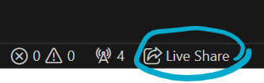
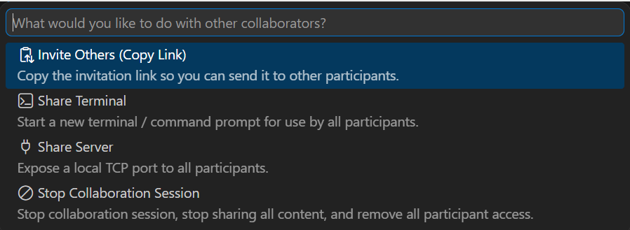

# J1 Group Project - Battleships

## Instructions

1. In each group, only one student creates a codespace.
2. Click **Live Share** icon in the codespace status bar (at the bottom)  
   
3. The status will change to **Shared** and a window will appear:  
   
4. Copy the link and share it with your programming group members to start collaborating
5. The team members should click on the link, then click **Accept read-write** to proceed.

---

## Your task

Create a single player battleship game that can be played using text input.

**Game Details**
-
**A. Game Setup:**

1. Use a 10x10 grid as the game board. You can use `~` or any other suitable character to represent empty spaces on the board.  
(_The following is simply a guide. Your board does not have to be exactly the same._)
```
~ ~ ~ ~ ~ ~ ~ ~ ~ ~ 
~ ~ ~ ~ ~ ~ ~ ~ ~ ~ 
~ ~ ~ ~ ~ ~ ~ ~ ~ ~ 
~ ~ ~ ~ ~ ~ ~ ~ ~ ~ 
~ ~ ~ ~ ~ ~ ~ ~ ~ ~ 
~ ~ ~ ~ ~ ~ ~ ~ ~ ~ 
~ ~ ~ ~ ~ ~ ~ ~ ~ ~ 
~ ~ ~ ~ ~ ~ ~ ~ ~ ~ 
~ ~ ~ ~ ~ ~ ~ ~ ~ ~ 
~ ~ ~ ~ ~ ~ ~ ~ ~ ~ 
```
2. Four (4) boards are needed:
   - Player's ship board (where player's ships are placed, and where enemy's strikes are marked)
   - Player's attack board (where they guess where the computer's ships are and attempt to strike them)
   - Computer's ship board (where computer's ships are placed, and where enemy's strikes are marked)
   - Computer's attack board (where computer guesses where the player's ships are and attempt to strike them)
2. Define **three** ships (1 of each of the following):
   - **B**attleship: **4 squares**
   - **C**ruiser: **3 squares**
   - **D**estroyer: **2 squares**.
3. Place ships **randomly** on the board for both player and computer, ensuring they don't overlap or extend beyond the grid. Ships can only be placed horizontally or vertically. An example is shown below:

```
~ ~ ~ ~ ~ ~ ~ ~ ~ ~
~ ~ ~ ~ ~ ~ ~ ~ ~ ~
~ ~ ~ B ~ C C C ~ ~
~ ~ ~ B ~ ~ ~ ~ ~ ~
~ ~ ~ B ~ ~ ~ ~ ~ ~
~ ~ ~ B ~ ~ D ~ ~ ~
~ ~ ~ ~ ~ ~ D ~ ~ ~
~ ~ ~ ~ ~ ~ ~ ~ ~ ~
~ ~ ~ ~ ~ ~ ~ ~ ~ ~
~ ~ ~ ~ ~ ~ ~ ~ ~ ~
```

**B. Gameplay:**

1. Allow the player a specified number of turns (default: 30) to guess the locations of the ships.
2. Display the player's ship and attack boards. Use symbols to indicate hits (`X`) and misses (`O`).
3. For each guess, prompt the player to input coordinates (x, y) to target a specific location on the board.
4. Decide on the preferred input format and validate the input, displaying an error message and re-prompting the player where necessary. For valid guesses, check if it's a hit or miss.
5. If it is a hit, display the type of ship that was hit and allow the player to make an additional guess without using a turn.
6. A ship is considered sunk when all its (accompanying) cells have been hit.
7. Update the game board accordingly to reflect the outcome.
8. Continue until the player has used up all their turns or has sunk all the ships.

**C. End of Game:**

1. If the player successfully sinks all the opponent's ships within the specified number of turns, declare victory.
2. If the player runs out of turns before sinking all the ships, declare defeat and reveal the locations of the remaining ships.
3. Display the computer's ship board with all ship locations and outcomes.
4. End the game (exit the program).

**D. Additional Features (optional):**

1. Implement difficulty levels with varying grid sizes and ship configurations.
2. Allow the player to choose the number of turns or adjust other game parameters.
3. Keep track of the player's score, in a **scores.txt** file, based on the number of turns taken to sink all the ships.

### Legend

Use the appropriate symbols to display the type of ship that has been hit

+ `B`: Battleship
+ `C`: Cruiser
+ `D`: Destroyer
+ `#`: Miss

## After the project

What challenges did you face trying to write working code as a group?
